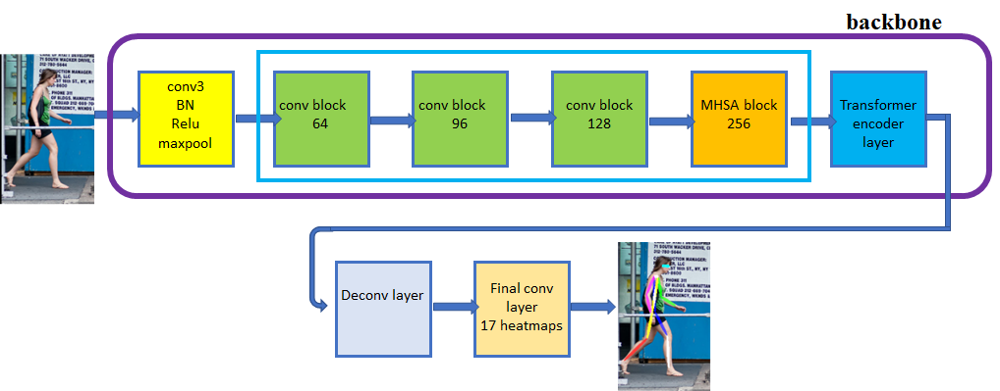
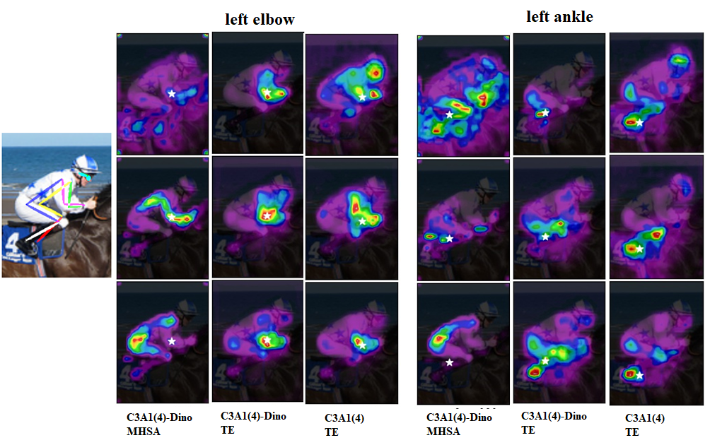
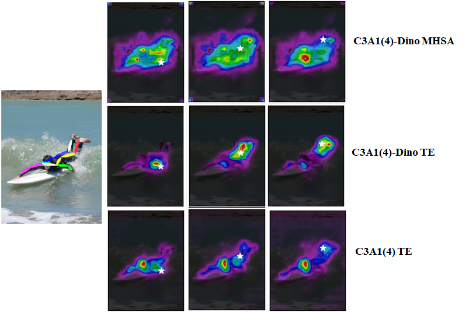

**BTranspose**: Bottleneck Transformers for Human Pose Estimation with Self-Supervised Pre-Training
========

PyTorch training code For BTranspose. This repo is built on top of Transpose (https://github.com/yangsenius/TransPose) and DINO (https://github.com/facebookresearch/dino), with changes made to include Bottleneck Transformers for the backbone. Also, the DINO is used for Self-Supervised pre-training of the backbone.

## Architectures

We consider different architectures for the backbone: C3A1(4), C3A1(8), C2A2(4), C2A1(4), etc. See the BTranspose paper for more details.

The C3A1 architecture is shown here with 3 CNN layer groups and 1 bottleneck layer group.

## Training

Training is a two step process. First, we start from random weights for the backbone and train it using DINO Self-Supervised Learning (SSL) on ImageNet. 
In the second step, we add the pose estimation head to the backbone and train on the COCO dataset. 

The SSL training hyper-params are same as DINO.

The image pre-processing and evaluation procedures are the same as the Transpose paper.

Run train.sh to train the pose estimation model.

## Evaluation

To test the pose model, run test.sh with the link to the weights file.

## Results

  

    
  

  

    
  

